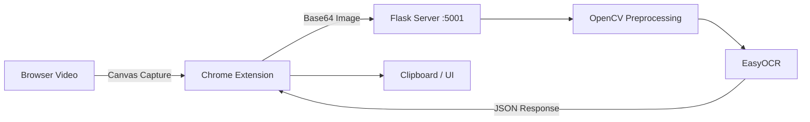

# 🪄 Magic OCR – Video Text Extractor

[](https://opensource.org/licenses/MIT)
[](https://flask.palletsprojects.com/)
[-4285F4?logo=google-chrome)]()

**Magic OCR** is a Chrome extension that allows you to instantly extract **code, notes, and text from any video** playing in your browser (YouTube, Udemy, Coursera, etc.).

Unlike traditional OCR extensions that struggle with motion and complex backgrounds, Magic OCR uses a **local Python backend** powered by **EasyOCR** and **OpenCV**, ensuring **high accuracy** while keeping your data **completely private**.


---

## 🏗️ Architecture

The application is split into two components:

1. **Frontend (Chrome Extension)**  
   Captures a video frame using the Canvas API and converts it into a Base64 image.

2. **Backend (Local Flask Server)**  
   Receives the image, preprocesses it using OpenCV, and extracts text using EasyOCR.



---

## 🚀 Features

- **High-Accuracy OCR** using EasyOCR (deep learning based)
- **Privacy First** – all processing runs locally on your machine
- **Universal Video Support** – works on any HTML5 video player
- **Smart Preprocessing** with OpenCV for noisy video frames
- **GPU Acceleration** (if available) for faster OCR
- **Clipboard Integration** for instant text copying

---

## 💻 Tech Stack

### Frontend (Chrome Extension)
- Vanilla JavaScript (ES6+)
- HTML5, CSS3
- Chrome Extensions API (Manifest V3)
- Canvas API
- Fetch API (Base64 → localhost)

### Backend (Python API)
- Flask, Flask-CORS
- EasyOCR (PyTorch-based)
- OpenCV (cv2)
- NumPy
- JSON / Base64 data transfer

---

## 🛠️ Installation & Setup

This project requires **both** the backend server and the Chrome extension.

---

### Step 1: Backend Setup (Python)

Clone the repository:
```bash
git clone https://github.com/Saachi26/magic-ocr.git
cd magic-ocr/backend
```

Create and activate a virtual environment (recommended):
```bash
python -m venv venv
```

**Windows**
```bash
venv\Scripts\activate
```

**Mac/Linux**
```bash
source venv/bin/activate
```

Install dependencies:
```bash
pip install flask flask-cors easyocr opencv-python numpy
```

> Note: EasyOCR will install PyTorch automatically. This may take a few minutes.

Start the server:
```bash
python app.py
```

The backend will run at:
```
http://localhost:5001
```

---

### Step 2: Install the Chrome Extension

1. Open Chrome and go to `chrome://extensions/`
2. Enable **Developer mode** (top right)
3. Click **Load unpacked**
4. Select the `frontend` (or `extension`) folder from this repository

---

## 📖 Usage

1. Ensure the Python backend is running
2. Open a video (YouTube, Udemy, Coursera, etc.)
3. Click the **Magic OCR** extension icon
4. Click **Scan Video** 
5. Wait briefly — the extracted text can now be copied to the clipboaard.

---

## 🔧 Troubleshooting

### ❌ “Failed to fetch” Error
- Make sure the backend server is running
- Confirm the port is `localhost:5001`

### 🐢 OCR is Slow
- EasyOCR runs faster on GPU
- If you have an NVIDIA GPU, install CUDA-compatible PyTorch
- CPU-only systems may take 1–3 seconds per capture

### 🌐 CORS Errors
Ensure Flask-CORS is enabled in `app.py`:
```python
from flask import Flask
from flask_cors import CORS

app = Flask(__name__)
CORS(app)
```

---

## 🤝 Contributing

Contributions are welcome!

1. Fork the project  
2. Create your feature branch  
   ```bash
   git checkout -b feature/NewFeature
   ```
3. Commit your changes  
   ```bash
   git commit -m "Add NewFeature"
   ```
4. Push to the branch  
   ```bash
   git push origin feature/NewFeature
   ```
5. Open a Pull Request

---

## 📄 License

This project is licensed under the **MIT License**.  
See the `LICENSE` file for details.
